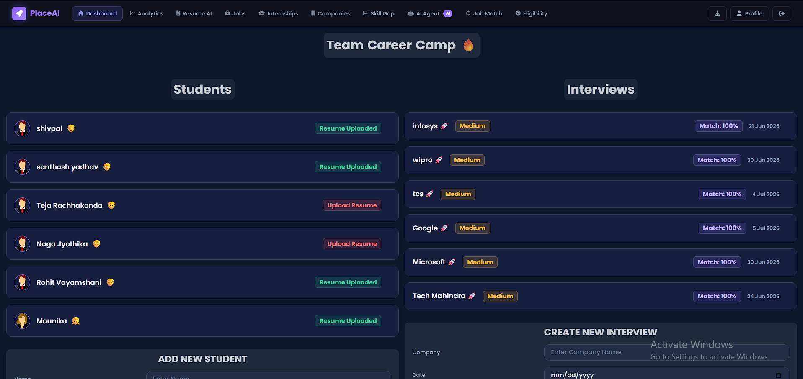
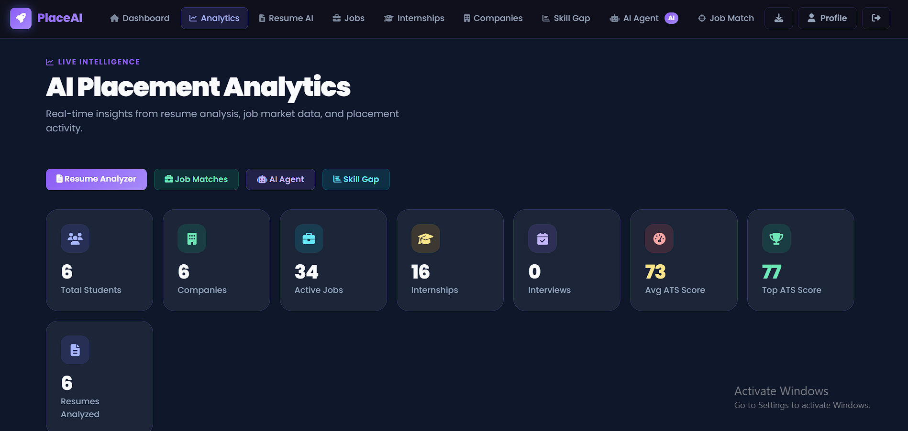
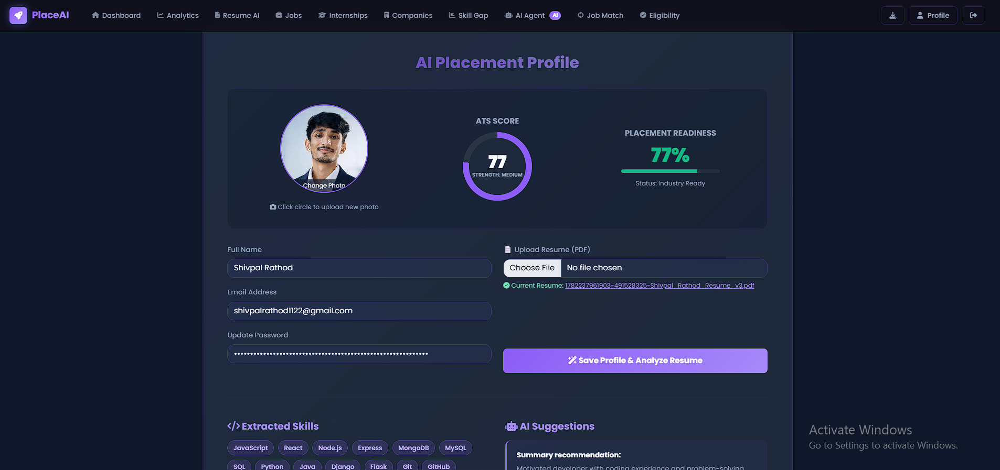
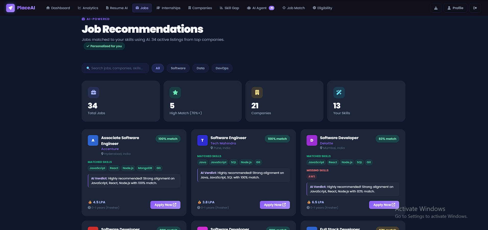
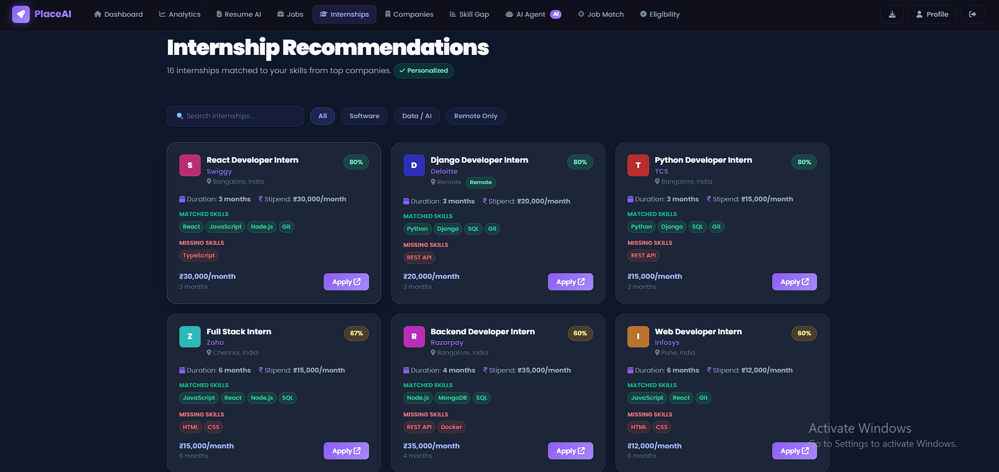
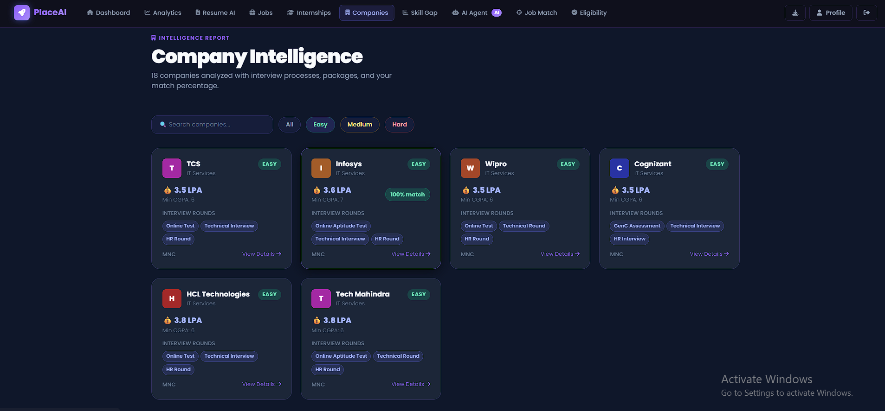
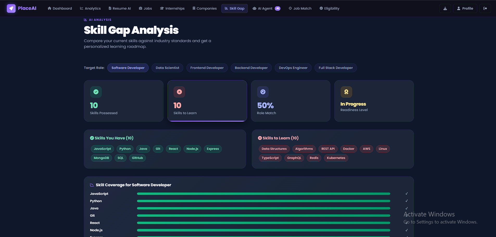
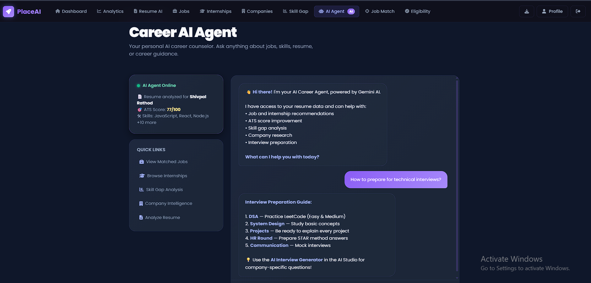
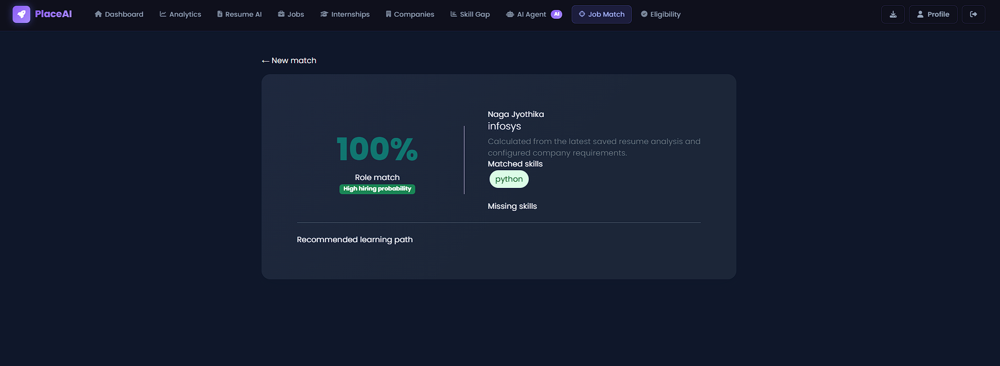
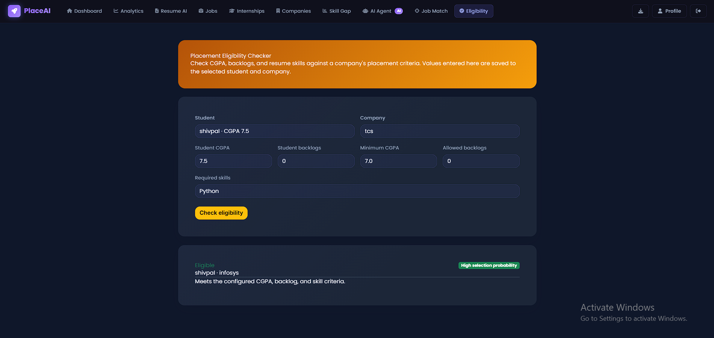

# 🚀 PlaceAI – AI-Powered Placement Intelligence Platform

<p align="center">
  <h3 align="center">Smart Placement Management with AI-Powered Career Guidance</h3>
  <p align="center">
    ATS Analysis • Job Matching • Internship Recommendations • Skill Gap Analysis • Company Intelligence • Career AI Agent
  </p>
</p>

---

## 📌 Overview

PlaceAI is an AI-powered Placement Intelligence Platform designed to modernize campus recruitment and student career preparation.

The platform combines traditional placement management features with advanced AI capabilities to help students improve placement readiness, optimize resumes, discover suitable jobs and internships, identify skill gaps, and prepare for recruitment processes.

Built using Node.js, Express.js, MongoDB, EJS, Bootstrap, Tailwind CSS, and Google Gemini AI.

---

# ✨ Core Features

## 🎓 Student Management

* Student Registration & Profile Management
* Academic Record Management
* CGPA Tracking
* Backlog Tracking
* Resume Upload & Management
* Skill Management
* Placement Readiness Monitoring

---

## 🏢 Company Management

* Company Registration
* Hiring Criteria Management
* Eligibility Requirements
* Placement Drive Tracking
* Recruitment Workflow Management

---

## 📅 Interview Management

* Interview Scheduling
* Interview Tracking
* Company-wise Interviews
* Placement Drive Management
* Candidate Selection Tracking

---

## 📊 Placement Analytics Dashboard

* Student Statistics
* ATS Score Distribution
* Placement Readiness Analysis
* Job Market Insights
* Internship Analytics
* Skill Demand Analytics
* Company Hiring Analytics
* Placement Performance Metrics

---

# 🤖 AI Features

## 📄 AI Resume Analyzer

Upload a PDF resume and receive:

### Features

* Resume Parsing
* ATS Score Generation
* Resume Strength Analysis
* Resume Weakness Detection
* Skill Extraction
* Placement Readiness Analysis
* Resume Improvement Suggestions

### Output

* ATS Score
* Readiness Percentage
* Extracted Skills
* Strengths
* Weaknesses
* Recommended Improvements

---

## 💼 AI Job Recommendation Engine

Provides personalized job recommendations based on student skills.

### Features

* Skill Matching
* Match Percentage Calculation
* Hiring Probability Estimation
* Missing Skill Detection
* Personalized Recommendations

### Example

```text
Role: Software Engineer

Match Score: 80%

Matched Skills:
✓ Python
✓ SQL
✓ Git

Missing Skills:
✗ Docker
✗ AWS
```

---

## 🎯 AI Internship Recommendation Engine

Recommends internships based on:

* Skills
* Resume Analysis
* Career Interests
* Placement Readiness

### Displays

* Company
* Role
* Duration
* Stipend
* Match Percentage

---

## 🧠 Skill Gap Analysis

Analyzes student skills against industry requirements.

### Features

* Skill Comparison
* Missing Skill Detection
* Career Roadmap Generation
* Learning Recommendations
* Placement Readiness Assessment

### Supported Career Paths

* Software Developer
* Full Stack Developer
* Backend Developer
* Frontend Developer
* Data Scientist
* DevOps Engineer

---

## 🏢 Company Intelligence

Provides detailed company insights.

### Features

* Company Profiles
* Hiring Process
* Interview Rounds
* Package Information
* Required Skills
* Hiring Difficulty
* Selection Criteria

### Companies Included

* Google
* Microsoft
* Amazon
* Salesforce
* Infosys
* TCS
* Wipro
* Cognizant
* Accenture
* Deloitte
* IBM
* Capgemini
* Tech Mahindra
* HCL

---

## 🤖 Career AI Agent

An intelligent career assistant powered by AI.

### Capabilities

* Career Guidance
* Resume Improvement Suggestions
* Placement Readiness Advice
* Job Recommendations
* Internship Recommendations
* Interview Preparation Guidance
* Skill Development Suggestions

### Example Questions

```text
What jobs match my profile?

How can I improve my ATS score?

Which skills should I learn next?

Am I placement ready?

How do I prepare for Infosys interviews?
```

---

## 🎯 Job Match Engine

Compares:

Student Resume

VS

Company Requirements

### Outputs

* Match Percentage
* Matched Skills
* Missing Skills
* Hiring Probability
* Placement Readiness

---

## ✅ Placement Eligibility Checker

Automatically evaluates eligibility based on:

* CGPA
* Active Backlogs
* Required Skills
* Company Criteria

### Result Categories

* Eligible
* Conditionally Eligible
* Not Eligible

---

## 🖼️ Screenshots

### Dashboard



### Analytics Dashboard



### AI Placement Profile



### Job Recommendations



### Internship Recommendations



### Company Intelligence



### Skill Gap Analysis



### Career AI Agent



### Job Match Engine



### Eligibility Checker



---

# 🏗️ System Architecture

```text
Browser (EJS Views)
        |
        ▼
Express Routes
        |
        ▼
Controllers
        |
        ▼
Services Layer
        |
        ├── Resume Analysis Engine
        ├── ATS Scoring Engine
        ├── Job Recommendation Engine
        ├── Internship Recommendation Engine
        ├── Skill Gap Engine
        ├── Company Intelligence Engine
        ├── Eligibility Engine
        └── Gemini AI Service
        |
        ▼
MongoDB Database
```

---

# 🛠️ Technology Stack

## Frontend

* HTML5
* CSS3
* Bootstrap 5
* Tailwind CSS
* JavaScript
* EJS
* SCSS
* Chart.js

---

## Backend

* Node.js
* Express.js

---

## Database

* MongoDB
* Mongoose

---

## Authentication

* Passport.js
* Session Authentication
* Google OAuth

---

## AI & Analytics

* Google Gemini AI
* Resume Parsing
* ATS Scoring
* Skill Extraction
* Job Recommendation Engine
* Internship Recommendation Engine
* Career Guidance Engine

---

# 📂 Project Structure

```text
PlaceAI
│
├── assets/
├── config/
├── controllers/
├── mailers/
├── models/
├── public/
├── routes/
├── screenshots/
├── services/
├── storage/
├── uploads/
├── views/
├── workers/
│
├── .env
├── .gitignore
├── ENV_FORMAT.json
├── gulpfile.js
├── index.js
├── package.json
├── package-lock.json
└── README.md
```

---

# ⚙️ Installation

## Clone Repository

```bash
git clone https://github.com/shivpalrathod/PlaceAI---AI-powered-Placement-Intelligence-Platform.git
```

```bash
cd PlaceAI---AI-powered-Placement-Intelligence-Platform
```

---

## Install Dependencies

```bash
npm install
```

---

## Configure Environment Variables

Create a `.env` file.

```env
ENVIRONMENT=development

DEPLOYMENT=local

DEVELOPMENT_DB=mongodb://127.0.0.1:27017/placement_cell

DEVELOPMENT_SESSION_COOKIE_KEY=your_secret_key

DEVELOPMENT_WEBSITE_LINK=http://localhost:8000

GOOGLE_CLIENT_ID=your_google_client_id

GOOGLE_CLIENT_SECRET=your_google_client_secret

GEMINI_API_KEY=your_gemini_api_key

GEMINI_MODEL=gemini-1.5-flash

PORT=8000
```

---

## Run Application

Development Mode

```bash
npm run dev_start
```

Production Mode

```bash
npm start
```

Visit:

```text
http://localhost:8000
```

---

# 🚀 AI Modules

| Module               | Route            |
| -------------------- | ---------------- |
| Resume Analyzer      | /ai/resume       |
| AI Jobs              | /ai/jobs         |
| AI Internships       | /ai/internships  |
| Career AI Agent      | /ai/career-agent |
| Skill Gap Analysis   | /ai/skill-gap    |
| Company Intelligence | /ai/companies    |
| Job Match Engine     | /ai/job-match    |
| Eligibility Checker  | /ai/eligibility  |
| Analytics Dashboard  | /ai/analytics    |

---

# 🔒 Security Features

* Session-Based Authentication
* Passport Authentication
* Google OAuth Login
* File Upload Validation
* MongoDB Data Validation
* Protected Routes
* Secure Environment Variables

---

# 🚀 Future Enhancements

* AI Mock Interviews
* Voice-Based Interview Assistant
* Resume Builder
* Student Portal
* Real-Time Job APIs
* WhatsApp Notifications
* Email Notifications
* Docker Deployment
* Kubernetes Deployment
* Mobile Application

---

# 👨‍💻 Developer

## Shivpal Rathod

B.Tech – Computer Science & Engineering

📧 Email: [shivpalrathod1122@gmail.com](mailto:shivpalrathod1122@gmail.com)

💼 LinkedIn: https://www.linkedin.com/in/shivpalrathod

🐙 GitHub: https://github.com/shivpalrathod

---

# ⭐ Support

If you found this project useful:

⭐ Star the Repository

🍴 Fork the Repository

📢 Share the Project

---

# 📄 License

This project is developed for educational, placement management, and career development purposes.

© 2026 Shivpal Rathod. All Rights Reserved.
